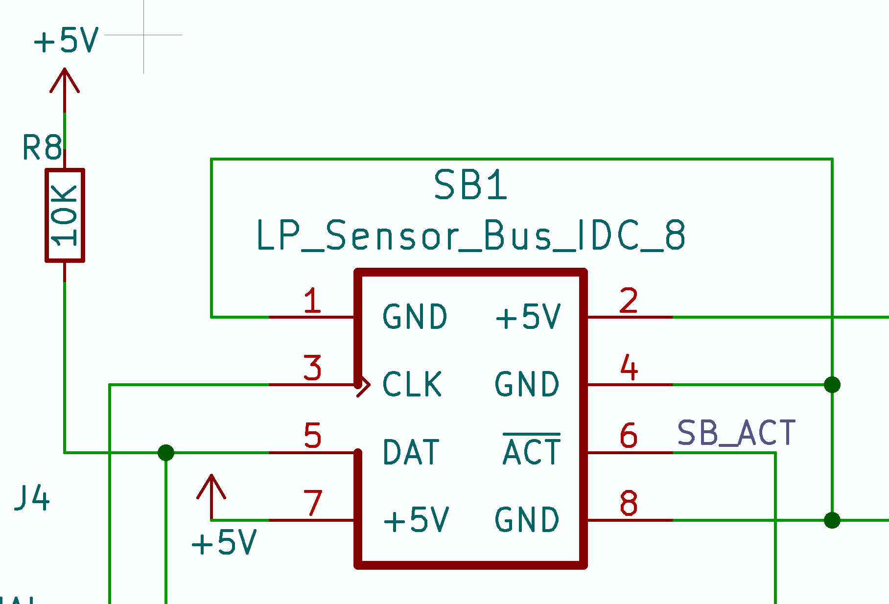

# SENSORBUS

Each smart sensor Module (subsystem) will be attached to a common bus that runs to a Node, with a Node supporting up to 8 (or maybe 16) Modules.

I decided against using UART-style serial connections because we don't want UART buffers on a device filling up with stuff not intended for that device. Instead we'll bit-bang our own protocol.

The communication doesn't need to be async because we'll only be pushing data in one direction at a time.

SensorBus uses three signals:

- `SB_CLK` - shared by all Modules
- `SB_ACT` - shared by all Modules
- `DAT` - unique line from each Module to the Node

Header pinout


```
 IDC HEADER               CABLE
 +-----------------+      1. GND
 | •1 GND   +5V 2• |      2. +5V
   •3 CLK   GND 4• |      3. CLK
   •5 /DAT /ACT 6• |      4. GND
 | •7 +5V   GND 8• |      5. /DAT
 +-----------------+      6. /ACT
                          7. +5V
                          8. GND
```

## MESSAGE FORMAT

Messages consist of bytes:

0. MSG_DATA_LEN - how many bytes of data in total, including this one
1. MSG_TYPE - set param, alert, data
2. Data
3. ... as much more data as necessary up to a max of 16 bytes (total)

## SIGNALS

By default, and when idle, all pins on both Node and Module are set as Inputs, so that they are effectively high-Z. There are pull-ups on all lines at the Node end.

| LABEL    | SIGNAL     | NOTE           |
|:--------:|:----------:|:--------------:|
| `SB_ACT` | Bus Active | Shared         |
| `SB_CLK` | Clock      | Shared         |
| `DAT`    | Data       | Dedicated, int |

The DAT pins (at both ends) have interrupts enabled on falling edges.

## SEND MESSAGE

The function names refer to the functions in my C++ library `SB_devicelib_ng` for modern AVR microcontrollers, notably the ATmega4809 and ATtiny1604.

| SENDER                            | RECEIVER                       |
|-----------------------------------|--------------------------------|
| cli()                             |                                |
| **_setSendMode()**                |                                |
| Wait for `SB_ACT` to be high      |                                |
| Set `SB_CLK` to OUTPUT, HIGH      |                                |
| Set `SB_ACT` to OUTPUT, LOW       | cli()                          |
| Set `DAT` to OUTPUT, HIGH         |                                |
| Strobe `DAT` LOW                  | **_setReceiveMode()**          |
| Set `DAT` to INPUT                | - Wait for `DAT` to be HIGH    |
| Wait for `DAT` ack strobe         | -Set `DAT` OUTPUT, HIGH        |
| Set `DAT` to OUTPUT, HIGH         | - ACK_PAUSE -                  |
|                                   | -Strobe `DAT` LOW              |
|                                   | -Set `DAT` to INPUT            |
| **sendMessage()**                 | **recvMessage()**              |
| - START_TRANSMISSION_PAUSE -      |                                |
| <-- Byte Loop -->                 |                                |
|  <-- Bit loop for each byte -->   | run _getByte() to get first    |
|  - For each bit in byte (8 times) | byte containing msglen, then   |
|    -- Set bit value on `SB_DAT`   | loop calling _getByte() to     |
|    -- BIT_PAUSE                   | get rest of message            |
|    -- Take `SB_CLK` LOW           | **_getByte()**                 |
|    -- BIT_PAUSE                   | - Wait for `SB_CLK` to go LOW  |
|    -- Take `SB_CLK` HIGH          | - Read bit                     |
|  <-- End Bit Loop -->             | - Wait for `SB_CLK` to go HIGH |
| - BYTE_PAUSE -                    |                                |
| <-- End Byte Loop -->             |                                |
| Release `DAT` to INPUT            |                                |
| - SETTLE_DELAY -                  | - SETTLE_DELAY -               |
| <-- reset to defaults -->         | <-- reset to defaults -->      |
|                                   |                                |
|                                   | Clear `DAT` port INTFLAGS      |
| sei()                             | sei()                          |
